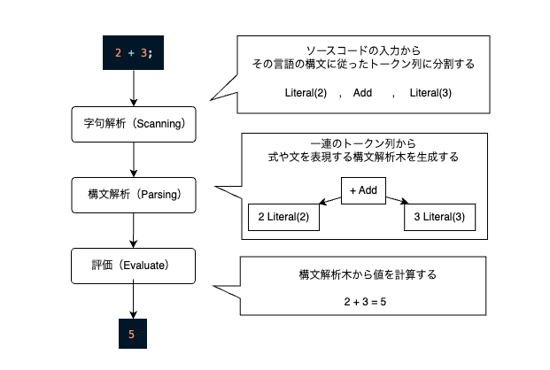
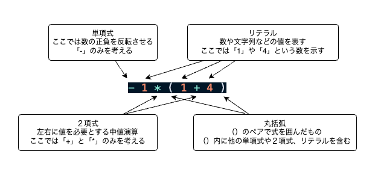
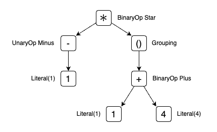

## はじめに

最近出版された [インタプリタの作り方](https://amzn.asia/d/9cDKgmF) で紹介されたプログラミング言語「Lox」を Rust での再実装に取り組んでいます。本記事では、その過程で遭遇した Visitor パターンの Rust での表現方法について探ります。

### 結論

enum とパターンマッチで十分そうに感じ、Visitor パターンを使う理由は特に思い至りませんでした...
なぜ `serde` では `Visitor` パターンを採用しているのかはわかりません...

## 解決したい課題は何か？

### 背景

まずは言語実装の背景を理解するために、以下のような構文を有する言語を実装する場合には、どのような処理を実現しなければならないかを考えてみます。ここはすでに内容を理解している方はスキップしてしまって問題ありません。

```rust
2 + 3;
```

大抵の言語では上記のようなソースコードが入力された際に、3 つのステップにわけて処理を進めていきます。



入力されたソースコードは言語の構文を表現する構文解析木として解析され、木をただる形で最終的な値の計算を行います。

### 課題

ではもう少し複雑な構文である下記のサンプルに、構文木に変換することを考えてみます。

```rust
- 1 * ( 1 + 4 )
```

この構文の構成要素は以下のとおりです。



ここから「Lox」言語と同じ式の文法を採用すると、以下のような構文木に変換されます。



このような構文木に解析できたことを検証するために、標準出力に構文木を出力しようと思うと、このデータ構造の走査と標準出力への表示という 2 つの処理を実行しなければならない。

## Visitor パターンとは何か？

Java 言語ではなぜ必要だったのか？

## Rust における課題解決

### Java における実装パターンを採用する場合

### Enum とパターンマッチングを採用する場合

## 実際の crate での適用例

## おわりに
